[toc]

plethora of ML frameworks：NCCL, Horovod, BytePS, Mesh-TensorFlow, Gpipe, Ray, HugeCTR, DALI

### Introduction

* 100TB model = 50万亿参数
  * 1万亿=1000B=1T，参数存储用 fp16

#### [Google Research: Themes from 2021 and Beyond](https://ai.googleblog.com/2022/01/google-research-themes-from-2021-and.html)

  * Trend 1: More Capable, General-Purpose ML Models
    * CoTrain models: PolyViT https://arxiv.org/abs/2111.12993
    * Pathways: https://blog.google/technology/ai/introducing-pathways-next-generation-ai-architecture/
      * 本质是增强神经网络结构的稀疏性，不仅仅是参数的稀疏性
      * Discussion: https://www.zhihu.com/question/495386434/answer/2199374013
  * Trend 2: Continued Efficiency Improvements for ML
    * Continued Improvements in ML Accelerator Performance
      * TPUv4
      * Device-ML: https://ai.googleblog.com/2021/11/improved-on-device-ml-on-pixel-6-with.html
    * Continued Improvements in ML Compilation and Optimization of ML Workloads
      * XLA: https://www.tensorflow.org/xla
      * https://mangpo.net/papers/xla-autotuning-pact2021.pdf
      * GSPMD: https://ai.googleblog.com/2021/12/general-and-scalable-parallelization.html
    * Human-Creativity–Driven Discovery of More Efficient Model Architectures
      * Transformet、ViT
    * Machine-Driven Discovery of More Efficient Model Architectures
      * NAS -> Primer、EfficientNetV2
      * RL: https://ai.googleblog.com/2020/07/automl-zero-evolving-code-that-learns.html
    * Use of Sparsity
      * Switch Transformer
  * Trend 3: ML Is Becoming More Personally and Communally Beneficial
    * 从 ML+产品（Pixel手机） 到 联邦学习 
    * phone cameras
    * live translate/caption
    * [federated analytics](https://ai.googleblog.com/2020/05/federated-analytics-collaborative-data.html) and federated learning
      * 复用 FL 的 evaluating 能力 (without the learning part)
      * Now Playing: on-device database
      * https://arxiv.org/pdf/1902.01046.pdf
      * secure aggregation protocol
  * Trend 4: Growing Impact of ML in Science, Health and Sustainability
      * Large-Scale Application of Computer Vision for New Insights
          * [large-scale study of synaptic connectivity in the human cortex](https://ai.googleblog.com/2021/06/a-browsable-petascale-reconstruction-of.html)
          * [deep-learning–based approach to weather forecasting](https://ai.googleblog.com/2021/11/metnet-2-deep-learning-for-12-hour.html)
    * Automated Design Space Exploration
      * a Transformer-based variational autoencoder learns to [create aesthetically-pleasing and useful document layouts](https://ai.googleblog.com/2021/06/using-variational-transformer-networks.html)
      * [automates the exploration of the huge design space of tweaks for computer game rules](https://ai.googleblog.com/2021/03/leveraging-machine-learning-for-game.html)
    * Application to Health
      * Our [ML-based phenotyping](https://www.sciencedirect.com/science/article/pii/S0002929721001889) method improves the scalability of converting large imaging and text datasets into phenotypes usable for genetic association studies, and our [DeepNull](https://www.biorxiv.org/content/10.1101/2021.05.26.445783v2) method better leverages large phenotypic data for genetic discovery. We are happy to release both as [open-source methods](https://github.com/Google-Health/genomics-research) for the scientific community.
    * ML Applications for the Climate Crisis
      * [eco-friendly routing in Google Maps](https://blog.google/products/maps/3-new-ways-navigate-more-sustainably-maps/)
      * making our [Maps products smarter about electric vehicles](https://ai.googleblog.com/2021/01/addressing-range-anxiety-with-smart.html) can help alleviate range anxiety, encouraging people to switch to emissions-free vehicles
        * the fear that the car will run out of power before reaching a charging station
        * the charging time can be a significant fraction of the total travel time and can vary widely by station, vehicle model, and battery level. In addition, the charging time is non-linear — e.g., it takes longer to charge a battery from 90% to 100% than from 20% to 30%.
        * this high density implies that a trip between two stations that are relatively far apart will undoubtedly pass through multiple other stations. In this case, maintaining information about the long edge is redundant, making it possible to simply add the smaller edges (*[spanners](https://en.wikipedia.org/wiki/Geometric_spanner)*) in the graph, resulting in sparser, more computationally feasible, graphs.
      * On a longer time scale, **fusion** holds promise as a game-changing renewable energy source. In a long-standing collaboration with TAE Technologies, we have [used ML to help maintain stable plasmas](https://ai.googleblog.com/2021/11/another-step-towards-breakeven-fusion.html) in their fusion reactor by suggesting settings of the more than 1000 relevant control parameters. With our collaboration, TAE achieved their major goals for their [Norman](https://en.wikipedia.org/wiki/TAE_Technologies#C-2W/Norman) reactor, which brings us a step closer to the goal of [breakeven fusion](https://en.wikipedia.org/wiki/Fusion_energy_gain_factor#Breakeven). The machine maintains a stable plasma at 30 million Kelvin (don’t touch!) for 30 milliseconds, which is the extent of available power to its systems. They have completed a design for an even more powerful machine, which they hope will demonstrate the conditions necessary for breakeven fusion before the end of the decade.
      * [wildfire boundary map](https://blog.google/products/search/mapping-wildfires-with-satellite-data/)
        * https://arxiv.org/abs/2111.02780
      * carbon neutral
        * https://arxiv.org/abs/2104.10350

* Trend 5: Deeper and Broader Understanding of ML
  * [Marian Croak’s vision for responsible AI at Google](https://blog.google/technology/ai/marian-croak-responsible-ai/)
  * RecSys
    * [Recent work has helped to better understand these relationships of the individual components](https://research.google/pubs/pub49284/)
    * [learn in an unbiased manner](https://storage.googleapis.com/pub-tools-public-publication-data/pdf/54a3b73ea1e85e94e5d5bb5a9df821a1f32aa783.pdf)
  * Political Correctness
    *  [reducing gender bias in our translation systems](https://ai.googleblog.com/2020/04/a-scalable-approach-to-reducing-gender.html)
    *   [designing for digital wellbeing](https://design.google/library/designing-for-digital-wellbeing/#normalizing-compassion) and [addressing racial equity issues in ML systems](https://design.google/library/racial-equity-everyday-products/), including [improving our understanding of the experience of Black Americans using ASR systems](https://www.frontiersin.org/articles/10.3389/frai.2021.725911/full?&utm_source=Email_to_authors_&utm_medium=Email&utm_content=T1_11.5e1_author&utm_campaign=Email_publication&field=&journalName=Frontiers_in_Artificial_Intelligence&id=725911)
  * distributional shift
    * [Deep Bootstrap framework](https://ai.googleblog.com/2021/03/a-new-lens-on-understanding.html)
  * [data cascades in ML](https://ai.googleblog.com/2021/06/data-cascades-in-machine-learning.html)
	  * [PAIR Guidebook](https://pair.withgoogle.com/guidebook/)
		* 
	* [Know Your Data](https://knowyourdata.withgoogle.com/)
	  *  [finding and investigating anomalous data](https://ai.googleblog.com/2021/09/discovering-anomalous-data-with-self.html)
	  * [methods to better understand the influence that particular training examples](https://ai.googleblog.com/2021/02/tracin-simple-method-to-estimate.html) can have on an ML model
	  * a [case study of how to use the Know Your Data tool](https://ai.googleblog.com/2021/08/a-dataset-exploration-case-study-with.html) to explore issues like gender bias and age bias in a dataset.
	* more inclusive and less biased public datasets
	  * [Dataset Search](https://datasetsearch.research.google.com/)
	  * [Perspective API](https://www.perspectiveapi.com/case-studies/) tool
	* we introduced a comprehensive taxonomy to reason about [the changing landscape of online hate and harassment](https://research.google/pubs/pub49786/). We also investigated [how to detect covert forms of toxicity](https://aclanthology.org/2021.hcinlp-1.3), such as microaggressions, that are often ignored in online abuse interventions, studied how conventional approaches to deal with disagreements in data annotations of such subjective concepts might [marginalize minority perspectives](https://arxiv.org/abs/2110.05699), and proposed a new [disaggregated modeling approach that uses a multi-task framework](https://arxiv.org/abs/2110.05719) to tackle this issue
	* 可解释性
	  * [understanding the acquisition of human chess concepts](https://arxiv.org/abs/2111.09259)
	  * [Language Interpretability Tool](https://pair-code.github.io/lit/)
	* Sociotechnical aspects
	  * [supporting family caregiving.](https://research.google/pubs/pub49916/)
	* ML and privacy
	  * highlighting that[ training data can sometimes be extracted from large models](https://www.usenix.org/system/files/sec21-carlini-extracting.pdf) and pointing to how privacy can be achieved in large models, e.g., as in[ differentially private BERT](https://arxiv.org/abs/2108.01624).
	  * federated learning and analytics
	  * other techniques: [ private clustering](https://ai.googleblog.com/2021/10/practical-differentially-private.html),[ private personalization](https://proceedings.neurips.cc/paper/2021/hash/f8580959e35cb0934479bb007fb241c2-Abstract.html),[ private matrix completion](http://proceedings.mlr.press/v139/chien21a/chien21a.pdf),[ private weighted sampling](http://proceedings.mlr.press/v130/cohen21b.html),[ private quantiles](http://proceedings.mlr.press/v139/gillenwater21a.html),[ private robust learning of halfspaces,](http://proceedings.mlr.press/v130/ghazi21a.html) and in general,[ sample-efficient private PAC learning](https://dl.acm.org/doi/10.1145/3406325.3451028)
	  * privacy notions: [label privacy](https://proceedings.neurips.cc/paper/2021/file/e3a54649aeec04cf1c13907bc6c5c8aa-Paper.pdf) and[ user](https://proceedings.neurips.cc/paper/2021/file/67e235e7f2fa8800d8375409b566e6b6-Paper.pdf) versus[ item level privacy](https://proceedings.neurips.cc/paper/2021/file/a89cf525e1d9f04d16ce31165e139a4b-Paper.pdf).
	* Other Work
	  * Quantun AI: https://blog.google/technology/research/2021-year-review-google-quantum-ai/、https://quantumai.google/learn/map
	    * the Noisy, Intermediate Scale Quantum (NISQ) computing era
	    * Qubit 和 Bit 的区别，在于前者的不确定性，给存储、计算、算法的形式都带来剧变
	    * 100 qubits to build a prototype of a error-corrected **logical qubit**
	      * 1000 qubits make a logical qubit long-live
	      * 10000 qubits => complex softwares requires significant work on fabrication technology, control software, and more
	      * 100000 qubits ~ 100 logical qubits: a quantum computer
	    * TFQ: https://www.tensorflow.org/quantum

### 分布式调度框架

* 模型+数据+资源+调度
  * 资源：池化/槽位，混部/潮汐/异构/多机房/新网络架构
    * 混部：离线/近线，弹性计算
  * 数据：batch/stream，stream数据语义更贴近在线语义
    * 物理数据（行间数据处理）、逻辑数据（行内数据处理）
* 多角色生命周期管理
  * 需求：角色依赖数据（promise->actor）、角色依赖角色（actor->actor）、多角色生命周期方法执行的同步
    * checkpoint/failover
  * 思路：
    * 全局状态机 （将最重的数据相关有状态角色抽象为全局状态机）/ 全局多个独立定时任务
    *  无状态op
      * 全局状态机（root AM）+局部状态机（role AM）过于复杂
    * Op 涉及的数据层面：1）metadata；<-- 2）resource or data；<-- 3）business logic

开源框架

* TFX on kubeflow, MLOps的实践
	
	* 各组件独立性更强，数据落盘环节多
	* kubeflow pipeline: DSL描述组件拓扑、每个组件打包成docker独立输入输出，提供了基于DAG与k8s的工作流调度
	  * https://cloud.google.com/blog/products/ai-machine-learning/getting-started-kubeflow-pipelines
	* 工作流拓扑和工作负载高度客制化
	  * 工作流调度 <- Argo
	  * 工作负载容器化
	* kubeflow pipeline组件
	  * 轻量级： [`kfp.components.func_to_container_op`](https://www.kubeflow.org/docs/components/pipelines/sdk/sdk-overview/)
	  * [可重复使用的component](https://www.kubeflow.org/docs/components/pipelines/v1/sdk/component-development/)
	  * Google Cloud TFX......
	
	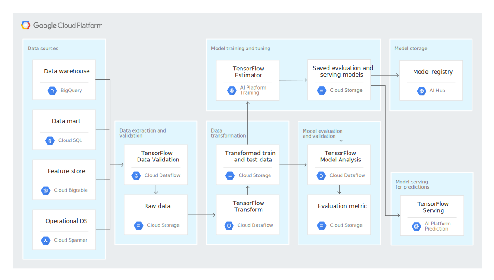
	
	
	* [TFX.periodic_training](https://github.com/tensorflow/community/blob/master/rfcs/20210115-tfx-periodic-training.md)
	
	
	    * ExampleGen processes and outputs one Span
	    
	        * span有version的概念
	    
	    * Frontfill/Backfill:
	    
	        * If an older Span needs to be updated, a new version of the Span is generated by **a backfill pipeline run** with specified Span id.
	        * 不建议热更，建议新version+backfill机制
	    
	    * 不建议concurrent执行，因为The execution of TFX Components depends on the ML Metadata status before executing
	    
	        * killandrun,allowtocomplete
	
	* Preprocessing: 数据校验、schema生成
	
	
	    * range config: 1）模型span与数据span对应；2）warmup start；3）输出模型的metadata
	
	* Metadata: 实现了数据、模型的上下游血缘追踪，比如模型性能变化的因果推理、更加精密的垃圾回收
	
	* 问题：
	
	
	  * user cost和system cost的折中，比如Workflow层面的调度如何与底层调度统一
	  * 兼顾核心场景（搜广推）和长尾场景（无监督、MAB）
	
	  
	
	  
	
	  
	


  * Flink ML
    * 难以描述复杂的多角色拓扑关系

  * Ray: 参考【Distributed-Systems笔记】

```java
// Flink ML
val trainingData: DataSet[LabeledVector] = ...
val testingData: DataSet[Vector] = ...

val scaler = StandardScaler()
val polyFeatures = PolynomialFeatures().setDegree(3)
val mlr = MultipleLinearRegression()

// Construct pipeline of standard scaler, polynomial features and multiple linear regression
val pipeline = scaler.chainTransformer(polyFeatures).chainPredictor(mlr)

// Train pipeline
pipeline.fit(trainingData)

// Calculate predictions
val predictions: DataSet[LabeledVector] = pipeline.predict(testingData)
```


### 召回

* 索引方式
  * BF (BruteForce): 秒级到分钟级构建，十万到百万量级
  * IVF (Inverted File System): 分钟级到小时级构建，百万到亿级
    * GPU 对聚类进行加速
  * HNSW: 分钟级到天级构建，千万到百亿级实时性
    * 可能会 sharding

* 量化方式
  * Int8 
  * PQ

### 粗排

#### COLD : Towards the Next Generation of Pre-Ranking System

阿里定向广告最新突破：面向下一代的粗排排序系统COLD - 萧瑟的文章 - 知乎
https://zhuanlan.zhihu.com/p/186320100

Computing power cost-aware Online and Lightweight Deep pre-ranking system

小精排支持复杂算法探索

* SENet: 模型训练时获取特征重要性数据
* 并行化：在取PS之后做模型并行预估，能比论文中的实现更高效
* 列存：全链路列存
* fp16
  * mix precision: fp32 BN + fp16 fully-connected layers
  * parameter-free normalization

#### Towards a Better Tradeoff between Effectiveness and Efficiency in Pre-Ranking: A Learnable Feature Selection based Approach, SIGIR 2021

Feature Selection method based on feature Complexity and variational Dropout (FSCD)

2.1 FSCD for Pre-Ranking Model，核心思想是 variational dropout

* 特征选取概率与特征复杂度负相关
* 特征复杂度的因素：特征类型、embedding size、key size (能类比于候选数量)
* 数学手段：
  * 公式(3)，损失函数，参数z的正则化
    * 特征复杂度越大，正则项系数越大
    * 损失函数及正则化系数的推导（见附录）
  * 公式(5)，Bernoulli 分布的平滑化

2.2 Fine-Tuning the Pre-Ranking Model

* 用精排模型参数来初始化参数，fine-tune 加速训练
* $\gamma_3=10^{-7}$ 描述候选数量，也是一个衡量特征复杂度的参数

### PyTorch

* 训练
  * 如果追求性能，可以用torch.fx改一下图，把手写op改进去
  * torch.fx symbolic_trace可以变成静态图
* 部署
  * 静态图，会用torchscript trace出来整个图，然后在ir上做一些编译优化

### Go+Torch

https://github.com/wangkuiyi/gotorch

Q: TensorFlow为什么需要引入图这个概念？

A: 

1.backward自动求导，需要定义前向的数据结构

2.python执行速度慢，决定执行效率的是图的解释器。图是python代码的另一种表示形式，开始包括前向计算过程，通过调用TensorFlow API，加入其它op包括反向计算过程和模型更新过程。构造图本质上是在编译。

* [TFRT](https://github.com/tensorflow/runtime)

调用libtorch内部的native function类比tf的op，但native function是函数，而不是一个class，每一个function可以用HLO（一种古老的适用于数值计算的语言）写一遍。gotorch调libtorch调pytorch XLA里的HLO程序，翻译成特定设备优化的代码

* native function有YAML描述，可自动生成Go Wrapper
* torchscripts：用到的python语法的子集 => python高层api可翻译成torchscripts再翻译

如果 Go+Torch 在未来一年里孕育成熟，有望优化以下核心 应用场景:

1. 统一训练和预测系统(目前训练用 Python 写，预测用 C++)
2. 统一云和端系统(目前云上用 TensorFlow，端上比如 xNN 调用 TensorFlow Lite)
3. 统一训练和预测时的数据处理流程(目前需要用 Python和C++分别做两套，开销大，而且容易出错)
4. 统一搜索、推荐、广告、金融核心、移动智能和端智能、无人驾驶等多个领域的基础架构
5. 能支持新的机器学习模式——online learning、GAN、reinforcement learning、imitation learning等。

### OneFlow: 大规模分布式深度学习框架

数据并行：allreduce + PS

模型并行：参数如何划分？复杂的通信模式


横向拓展：片间高速互联，e.g. TPU

纵向拓展：单个芯片从通用到专用


静态调度与流式执行系统


OneFlow架构

* actor及流水线
  * 内存槽，用类似rust的ownership解决内存冲突问题，ownership随状态转移


* node placement: consistent view
  * SBP, 在op层面实现数据和模型并行 
  

### MLOps

* 磁盘U形故障率 ~ GPU故障率建模


### AWS - SageMaker

#### Sagemaker Immersion Labs

https://sagemaker-immersionday.workshop.aws/

[Github Link](https://github.com/aws-samples/amazon-sagemaker-immersion-day)

* Lab 1. Feature Engineering
* Lab 2. Train, Tune and Deploy XGBoost
  * Hyperparameter tuner
* Lab 3. Bring your own model
  * Bring your own container
  * Bring your own script
* Lab 4. Autopilot, Debugger and Model Monitor
  * Autopilot: generates notebooks for you
  * debug hooks that listen to events
  * class activation maps with SageMaker Debugger
* Lab 5. Bias and Explainability
* Lab 6. SageMaker Pipelines

总体分析

* python SDK, IDE 式的开发体验
* instance per notebook
  * brings elastic, dedicated compute for each person, project, dataset, step in your ML lifecycle
* Train a model
  * Build-in algorithms
  * Script mode
  * Docker container
  * AWS ML marketplace
  * Notebook instance
* use_spot_instances=True

#### SageMaker Debugger

《AMAZON SAGEMAKER DEBUGGER: A SYSTEM FOR REAL-TIME INSIGHTS INTO MACHINE LEARNING MODEL TRAINING》

https://github.com/awslabs/sagemaker-debugger#run-debugger-locally

* 痛点：训练过程长、不透明（训练进程、底层资源情况）
  * e.g. 遇到过拟合，终止训练任务的机制
* 关键特性
  * 数据采集：零代码修改；持久化存储
  * 自动数据检测：检测训练过程、系统瓶颈；提前终止；自定义规则；与 Cloudwatch 事件集成
  * 实时监控：指标调试；通过训练的 step 或时间间隔进行资源利用率分析
    * 算法层面：特征重要性、layer weight/gradient 信息展现、帮助理解 serving/training 一致性 (data drift)
  * 节省时间和成本：原型验证；资源
  * 集成在 Studio 环境中
* 实现
  * 训练容器 ---> 存储 ---> Debugger 容器 ---> actions
    * Actions: [cloudwatch](https://aws.amazon.com/cn/cloudwatch/) + [lambda function](https://aws.amazon.com/cn/lambda/)
  * [smdebug](https://pypi.org/project/smdebug/#description)
  * Profiling
    * 原生框架分析：可能增加 GPU 内存消耗
    * 数据加载分析：调试器收集 DataLoader 事件信息，可能影响训练性能
    * python：cProfile (python operator), Pyinstrument (隔段时间记录堆栈情况)
  * Debugger Hook: 类似 Tensorflow 的 hook，传入 callback 对象，采集指标到存储
  * Rule 集成在 Hook 中: 系统层、模型层（过拟合、梯度消失）

```python
# record tensors
import smdebug.tensorflow as smd
hook = smd.KerasHook("/opt/ml/tensors")
model.fit(x, y, epochs=10, callbacks=[hook])

custom_collection=CollectionConfig(
	name="relu_ouput",
	parameters={
		"include_regex": ".*relu_output",
		"save_interval": "500"
  }
)

# access tensors
from smdebug.trials import create_trial
trial = create_trial("/opt/ml/tensors")
trial.tensor_names(regex=".*")
trial.tensor("conv0").value(step)

# monitor tensors
while not trial.loaded_all_steps:
  steps = trial.steps(mode=modes.EVAL)
	t = trial.tensor("conv1").value(steps[-1])
	plt.hist(t.flatten(), bins=100)
  
# analyze tensors
labels = "CrossEntropyLoss_input_0"
predictions = "CrossEntropyLoss_input_1"
inputs = "ResNet_input_0"
for step in trial.steps():
  l = trial.tensor(labels).value(step)
	p = trial.tensor(predictions).value(step)
	i = trial.tensor(inputs).value(step)
for prediction, label, img in zip(p,l,i):
	if prediction != label:
		plt.imshow(img)
```

* Challenges
  * Scale rule analysis by offloading into separate containers
  * Reduce overhead when recording and fetching tensors
    * optimize data retrieval with the help of index files that store metadata such as name, shape, and step along with the location of tensor objects
  * Separate compute and storage and minimize impact on training
* Rules
  * datasets
  * activation functions: sigmoid's vanishing gradients, dead ReLU
  * poor initialization: 随机 weights 是保证 independently learn


* Deployment Results and Insights
  * latent space + [t-SNE]()
  * Using Debugger for iterative model pruning
    * Many types of pruning techniques are known, for example, structured versus unstructured prun-ing, randomly removing weights versus removing by size or rank, and iterative pruning versus one-shot pruning (Blalock et al., 2018). In case of CNNs, iterative filter pruning is known to achieve state of the art results


### Other MLSys

* [介绍 Facebook 推荐系统的文章](https://engineering.fb.com/2021/01/26/ml-applications/news-feed-ranking/)
  * 多目标 MMoE、分数融合
  * 相比抖音，社交属性更强
    * unread bumping logic: 未来得及展现的信息
    * action-bumping logic: 交互过的信息有再次交互
  * serving 流程
    * integrity processes
    * pass 0: lightweight model 选出 500 条
    * pass 1: 精排 500 条
      * 《Observational data for heterogeneous treatment effects with application to recommender systems》
      * People with higher correlation gain more value from that specific event, as long as we make this method incremental and control for potential confounding variables.
    * pass 2: 混排，contextual features, such as content-type diversity rules

#### DataFunTalk：广告推荐系统专场

#### 快手

* sim 基于embedding聚类

* ppnet：base网络不bp，gate独立网络独立学，不影响base embedding

* 互动特征稀疏怎么办：mmoe由时长主导，改进比较传统，主要方向是稀疏样本加权、task网络设计

* log时间戳 也是 positon embedding 离散化

#### 美团

* 美团优选 张亚峰：推荐系统结合因果推断

#### 微软新闻

* msnews.github.io
  * MIND acl2020

* bert noisytune 大模型finetune
* responsible的目标
  * [cprs: objective beyond click](https://www.ijcai.org/proceedings/2020/0418.pdf)
* fairness：fairrec 学习一个serving用的无偏网络，比如让模型估不出来性别


#### DeepRec

[Github](https://github.com/alibaba/DeepRec)

[Doc入口](https://deeprec.readthedocs.io/zh/latest/)

* 稀疏功能
  * 自适应动态弹性特征
  * 特征淘汰及准入
  * 基于特征频率的动态弹性维度（FAE）

* 异步训练框架 StarServer
  * 通信协议、zerocopy
  * 基于图拓扑序的图Fusion
  * Run To Completion and Lockless Graph Execution

* 同步训练框架 hybridbackend
  * embedding层：大的fc用alltoallv，小的fc用allreduce
    * 小=稠密="dense sparse"，dense emb table = tf原生variable
    * 思路参考 https://chowdera.com/2022/03/202203260952140771.html

* prmalloc
  * 池子共享，不再用 TLS cache，因为op可能是不同线程运行

* 业务相关优化
  * user特征优化

* 图优化-smartstage
* embedding store
  * embedding多级混合存储：cpu cache dram pmem ssd
    * 多级混合存储能支持单机serving，主要从ssd读

### MLSys Courses

[cs294-2022](https://ucbrise.github.io/cs294-ai-sys-sp22/)

[cs294-2019](https://ucbrise.github.io/cs294-ai-sys-fa19/)


#### CSE 599W: Systems for ML

http://dlsys.cs.washington.edu/schedule

##### Lecture 1: Introduction to Deep Learning

* Ingredients in DL
  * 模型、目标函数、技巧、数据
  * 技巧包括Regularization, initialization (coupled with modeling)
    * Dropout: Overfitting prevention
    * Xavier Initialization
* 模型结构
  * Fully Connected Layer
  * Convolution = Spatial Locality + Sharing
    * Convolution with Multiple Channels
  * Pooling Layer: Can be replaced by strided convolution
  * LeNet, AlexNet
  * Why ReLU?
    * Cheap to compute
    * It is roughly linear..
  * Dropout
    * Randomly zero out neurons with probability 0.5
    * During prediction, use expectation value (keep all neurons but scale output by 0.5)
  * GoogleNet: Multiple Pathways, Less Parameters
    * Inception Module
    * [1*1 卷积减小channel维数，用于channel融合，减少计算量](https://stats.stackexchange.com/questions/194142/what-does-1x1-convolution-mean-in-a-neural-network)
* Vanishing and Explosive Value Problem
  * In ConvNets, the weight are not tied, but their magnitude matters; Deep nets training was initialization sensitive
  * Batch Normalization: Stabilize the Magnitude
    * Subtract mean -> Divide by standard deviation -> Output is invariant to input scale! -> Scale input by a constant –> Output of BN remains the same
    * Impact: Easy to tune learning rate, less sensitive initialization
    * The Scale Normalization (Assumes zero mean)
  * ResNet: F(x) + x
* [lab1_mnist.ipynb](http://dlsys.cs.washington.edu/pdf/lab1_mnist.ipynb): MXNet入门，包括Gluon API、写模型、训练推理api

##### Lecture 3: Overview of Deep Learning System


* softmax in numpy
  * softmax内蕴了logistic regression
  * 手算梯度 + SGD
    * 梯度推导见【Machine-Learning笔记】
* softmax in tinyflow
* The Declarative Language: Computation Graph
  * Nodes represents the computation (operation)
  * Edge represents the data dependency between operations

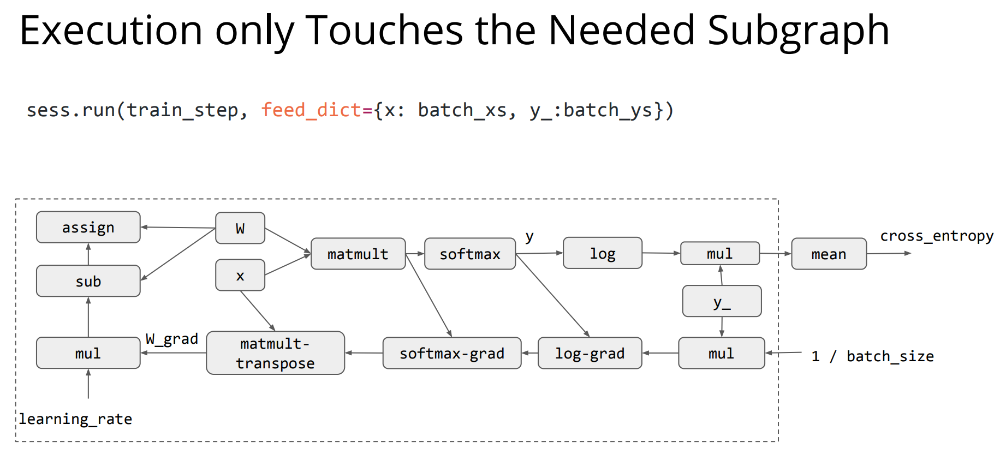

* Computation Graph Optimization
  * Deadcode elimination
  * Memory planning and optimization
  * Parallel Scheduling
    * Code need to run parallel on multiple devices and worker threads
    * Detect and schedule parallelizable patterns
  * GPU Acceleration
* Hardware backend
  * Each Hardware backend requires a software stack
  * New Trend: Compiler based Approach

##### Lecture 4: Backpropagation and Automatic Differentiation

* Symbolic Differentiation
  * For complicated functions, the resultant expression can be exponentially large
  * Wasteful to keep around intermediate symbolic expressions if we only need a numeric value of the gradient in the end
  * Prone to error
* Numerical Differentiation
  * Bad: rounding error, and slow to compute
  * A powerful tool to check the correctness of implementation, usually use h = 1e-6
* Backpropogation
  * Easy to understand and implement
  * Bad for memory use and schedule optimization
    * You always need to keep intermediate data in the memory during the forward pass in case it will be used in the backpropagation.
    * Lack of flexibility, e.g., compute the gradient of gradient.
* Automatic Differentiation (autodiff)
  * Generate gradient computation to **entire** computation graph，计算过程全图化
  * Better for system optimization
  * 具体算法见【code-reading笔记】-- Tinyflow -- autodiff

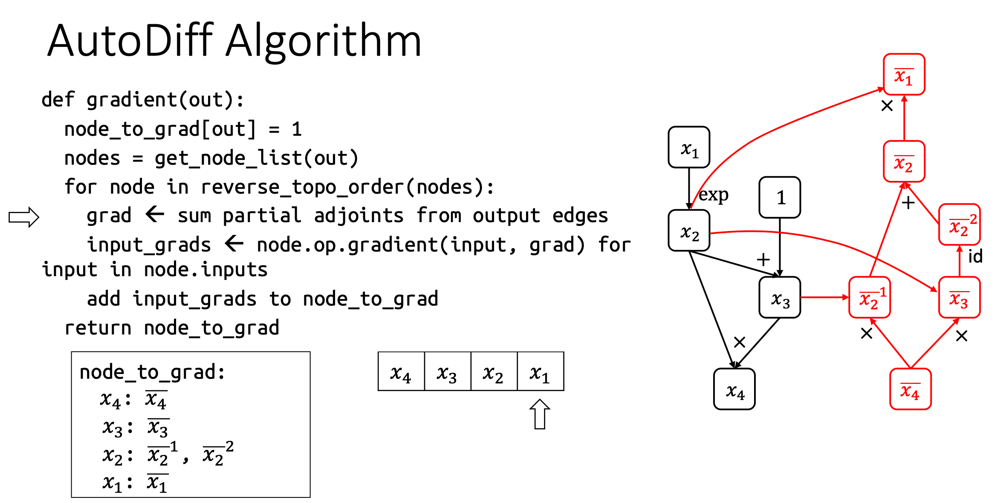

##### Paper: 《Automatic differentiation in PyTorch》

* Features:

  * Dynamic, define-by-run execution; Immediate, eager execution
  * In-place operations; No tape; Core logic in C++
    * PyTorch (and Chainer) eschew this tape; instead, every intermediate result records only the subset of the computation graph that was relevant to their computation.

* ```python
  torch.autograd.grad(f(x, y, z), (x, y))
  
  from torch.autograd import Variable
  x, prev_h = Variable(torch.randn(1, 10)), Variable(torch.randn(1, 20))
  W_h, W_x = Variable(torch.randn(20, 20)), Variable(torch.randn(20, 10))
  i2h = torch.matmul(W_x, x.t())
  h2h = torch.matmul(W_h, prev_h.t())
  (i2h + h2h).tanh().sum().backward()
  ```

* API

  * “requires grad” and “volatile” flags
  * hooks:`x.register_hook(lambda grad: print(grad))`
  * Extensions

* Implementation

  * Variable

    * a wrapper around a Tensor
    * holds a reference to a graph of Function objects
    * mutated when an in-place operation occurs

  * Graph: immutable, purely functional representation of the derivative of computed function

  * Function: a closure that has all context necessary to compute vector-Jacobian products

  * 内存管理：PyTorch’s Variable and Function must be designed to work well in a reference counted regime.

    * a Function records pointers to the Function which consumes its result

    * Another challenge is avoiding reference cycles. A naıve implementation of automatic differentiation can easily introduce such cycles (e.g. when a differentiable function would like to save a reference to its output). PyTorch breaks them by recording not a full-fledged variable, but instead a [“saved variable”](https://github.com/pytorch/pytorch/blob/master/torch/csrc/autograd/saved_variable.cpp), which omits a pointer to the Function in such cases.

      * ```c++
        // We want grad_fn here to provide the most helpful debug message to the user
        // if versions don't match
        
        auto grad_fn = is_inplace_on_view_ ? weak_grad_fn_.lock()
          : !hooks_ ? saved_original_ ? data_.grad_fn() : nullptr
            : grad_fn_;
        ```

    * Supporting in-place operations：不兼容Invalidation和Aliasing这两种情况

      * Invalidation: Every underlying storage of a variable is associated with a version counter, which tracks how many in-place operations have been applied to the storage.
      * Aliasing: the in-place addition to x also causes some elements of y to be updated; thus, y’s computational history has changed as well.

##### Paper: 《Automatic differentiation in ML: Where we are and where we should be going》

* Introduction
  * 现状：operator overloading (OO) and source transformation (ST) used for AD
  * drawing insights from functional languages, graph-based IRs, and AD
* Background:
  * Forward mode has constant memory requirements and its runtime complexity scales with the number of inputs. Reverse mode’s runtime complexity scales with the number of outputs, and its memory complexity grows with the number of intermediate variables. In principle, forward and reverse mode can be mixed, but finding the optimal way of doing so is NP-complete [27].
  * Since the number of inputs is significantly larger than the number of outputs, reverse mode AD is to be preferred
  * Automatic differentiation: Two methods
    * Operator overloading (OO): record a tape
      * downside: Having an embedded interpreter inside of the host language can complicate debugging and performance analysis.
      * PyTorch, Autograd, and Chainer
    * source transformation (ST)
      * explicitly construct a program with a reversed control flow, which means that it needs transformation rules for function calls and control flow statements such as loops and conditionals 偏静态
      * still ensure that intermediate variables from the forward pass are accessible by the adjoint
        * Tape-based
          * The tape used in ST stores only the intermediate variables, whereas the tape in OO is a program trace that stores the executed primitives as well.
        * Closure-based
          * no AD-specific compiler passes are needed: a functional language compiler will recognize the non-local use of the intermediate variables by the fact that they are free variables in the generated closure or continuation.
  * Dataflow programming
    * Theano, TensorFlow, and MXNet
    * follow the dataflow program- ming paradigm [21] and use computation graphs as their **intermediate representation**
    * These graph representations do not have scoping or recursive function calls, which means that AD is much easier to implement with ST
    * 设计取舍
      * Function Calls: TensorFlow and Theano implement a type of subroutine through their Defun and OpFromGraph constructs, but these must be explicitly constructed by the user and don’t support recursion.
      * Scoping: TensorFlow has a concept it refers to as ‘scoping’, but these scopes are not lexical and can be reentered at any time, so the lifetime of a value is not affected by its scope.
  * Programming languages and compilers
    * The dataflow graph is an intermediate representation which is optimized using a series of compiler passes. The resulting program is compiled (e.g., XLA) and/or interpreted (e.g., the TensorFlow/Theano runtimes). Similarly, PyTorch has started optimizing its traced Python programs using just-in-time (JIT) compiler approaches.
    * Python because of its flexibility with the need for high performance and speed is an open question. ML frameworks have focused on metaprogramming and using C extensions, but other approaches are possible. For example, Cython [6] is a superset
      performance and speed is an open question.
* Graph-based direct intermediate representation
  * graph based, purely functional, closure representation, strongly typed
  * IR specification
    * Concretely, our representation represents a function as a graph object with a list of parameter nodes and a single return node (multiple return values are supported through tuples). A node represents a function application and has an ordered list of incoming edges. The first incoming edge is a pointer to the function to apply, and the rest point to the arguments. Constants are represented as nodes with no incoming edges and a value field. Links between nodes are bidirectional, so that graphs can be traversed in either direction. Each non-constant node belongs to a single graph.
  * Source transformation
    * In order to ensure that our transformation can be applied again on the transformed program (so we can use reverse-over-reverse to compute second-order derivatives), it must be able to handle functions with free variables.
* Myia
  * Myia is a functioning proof of concept of a toolchain that uses the proposed graph representation
  * Python front end
    * Myia uses Python’s inspect module to parse the function into an abstract syntax tree (AST), and converts that AST into the graph representation we previously described
  * Type inference
  * Optimization

##### Lecture 5: GPU Programming

* 内容融入【nvidia笔记】

##### Lecture 6: Optimize for Hardware Backends

* Where are we: gap between computation graph and hardware
  * Goal: High Level Program to Bare Metal Code
  * What are the tricks you can do to make your program run faster on CUDA/x86/any backend?
* Cache Line Aware Tiling
  * Output-tiled
  * cache line aware
  * 收益来源于memory reuse，减少load dram time cost

```c++
dram float A[n/b1][b1][n];
dram float B[n/b2][b2][n];
dram float C[n/b1][n/b2][b1][b2];
for (int i = 0; i < n/b1; ++i) {
  l1cache float a[b1][n] = A[i];
  for (int j = 0; j < n/b2; ++j) {
    l1cache b[b2][n] = B[j];
		for (int x = 0; x < b/v1; ++x) {
     for (int y = 0; x < b/v1; ++y) {
       register float c[v1][v2] = 0;
       for (int k = 0; k < n; ++k) {
         register float ar[v1] = a[x][k];
         register float br[v1] = b[y][k];
         C += dot(ar, br)
       }
 	    }
    }
  }
}
```

* operator fusion
* Optimizations = Too Many Variant of Operators
  * Different tiling patterns
  * Different fuse patterns
  * Different data layout
  * Different hardware backends

##### Lecture 7: Automatic Code Generation --- TVM Stack

https://tvm.apache.org/

https://github.com/apache/tvm

* Computational Graph as IR
  * Approach taken by: TensorFlow XLA, Intel NGraph, Nvidia TensorRT
  * XLA: Tensorflow Compiler
  * TensorRT: Rule based Fusion
    * relu+bias+conv --> CBR
    * Simple Graph-based Element-wise Kernel Generator: Fusion Pass + CodeGen Pass


* The Remaining Gap of "Computational Graph as IR"
  * need to build and optimize operators for each hardware, variant of layout, precision, threading pattern …
  * hardware backend越多，手工优化op的成本越高
* Emerging Tools Using Tensor Expression Language
  * Halide: Image processing language
  * Loopy: python based kernel generator
  * TACO: sparse tensor code generator
  * Tensor Comprehension

* TVM
  * Tensor Level Optimizations (Tensor Expression Language)
    * `C = t.compute((m, n), lambda i, j: t.sum(A[i, k] * B[j, k], axis=k))`
  * Tensor Index Expression

```python
# tvm
# Compute C = dot(A, B.T)
import tvm
m, n, h = tvm.var('m'), tvm.var('n'), tvm.var('h')
A = tvm.placeholder((m, h), name='A')
B = tvm.placeholder((n, h), name=‘B')

k = tvm.reduce_axis((0, h), name=‘k')
C = tvm.compute((m, n), lambda i, j: tvm.sum(A[i, k] * B[j, k], axis=k))
                    
# Convolution
out = tvm.compute((c, h, w), lambda i, x, y: tvm.sum(data[kc,x+kx,y+ky] * w[i,kx,ky], [kx,ky,kc]))
                    
# ReLU
out = tvm.compute(shape, lambda *i: tvm.max(0, out(*i))
```

* Schedule: Tensor Expression to Code
  * 核心思路：Separation of Compute and Schedule, introduced by Halide
* Key Challenge: Good Space of Schedule
  * Should contain any knobs that produces a logically equivalent program that runs well on backend models
  * Must contain the common manual optimization patterns
  * Need to actively evolve to incorporate new techniques

```python
# Example Schedule Transformation
C = tvm.compute((n,), lambda i: A[i] + B[i])
s = tvm.create_schedule(C.op)
xo, xi = s[C].split(s[C].axis[0], factor=32)  # 
s[C].recorder(xi, xo)
s[C].bind(xo, tvm.thread_axis(“blockIdx.x”)
s[C].bind(xi, tvm.thread_axis(“threadIdx.x”)
```

* TVM Schedule Primitives
  * Loop Transformations, Thread Bindings, Cache Locality, Thread Cooperation, Tensorization, Latency Hiding
  * Schedule Space Exploration --> AutoTuner tune多个kernel

```python
# Extending Compute Primitives
# Symbolic Loop: Y = cumsum(X)
import tvm
m = tvm.var("m")
n = tvm.var("n")
X = tvm.placeholder((m, n), name="X")
s_state = tvm.placeholder((m, n))
s_init = tvm.compute((1, n), lambda _, i: X[0, i])
s_update = tvm.compute((m, n), lambda t, i: s_state[t-1, i] + X[t, i])
Y = tvm.scan(s_init, s_update, s_state, inputs=[X])
```

* Hardware designer: declare tensor instruction interface

```python
w, x = t.placeholder((8, 8)), t.placeholder((8, 8))
k = t.reduce_axis((0, 8))
y = t.compute((8, 8), lambda i, j: t.sum(w[i, k] * x[j, k], axis=k))
def gemm_intrin_lower(inputs, outputs):
 ww_ptr = inputs[0].access_ptr(“r")
 xx_ptr = inputs[1].access_ptr("r")
 zz_ptr = outputs[0].access_ptr("w")
 compute = t.hardware_intrin("gemm8x8", ww_ptr, xx_ptr, zz_ptr)
 reset = t.hardware_intrin("fill_zero", zz_ptr)
 update = t.hardware_intrin("fuse_gemm8x8_add", ww_ptr, xx_ptr, zz_ptr)
 return compute, reset, update

gemm8x8 = t.decl_tensor_intrin(y.op, gemm_intrin_lower)
```

* High Level Compilation Frontend

```python
import tvm
import nnvm.frontend
import nnvm.compiler
graph, params = nnvm.frontend.from_keras(keras_resnet50)
target = tvm.target.cuda()
graph, lib, params = nnvm.compiler.build(graph, target) 

module = runtime.create(graph, lib, tvm.gpu(0))
module.set_input(**params)
module.run(data=data_array)
output = tvm.nd.empty(out_shape, ctx=tvm.gpu(0))
module.get_output(0, output)
```


##### Paper: 《TVM: An Automated End-to-End Optimizing Compiler for Deep Learning》

* Abstract/Conclusion
  * TVM solves optimization chal-lenges specific to deep learning, such as high-level operator fusion, mapping to arbitrary hardware primitives, and memory latency hiding.
* Introduction
  * TVM, a compiler that takes a high-level specification of a deep learning program from existing frameworks and generates low-level optimized code for a diverse set of hardware back-ends.
  * Leveraging Specific Hardware Features and Abstractions.
  * Large Search Space for Optimization
    * tensor expression language
    * automated program optimization framework
      * autotune与手工优化，后者解决通用问题，前者解决长尾问题并优化后者参数
    * graph rewriter

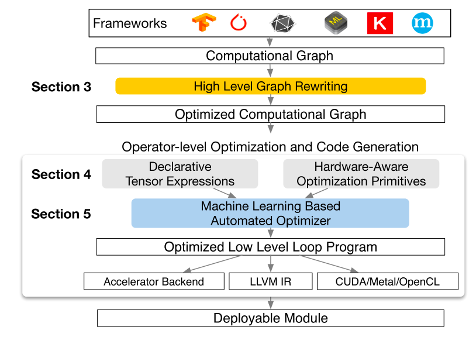

* Optimizing Computational Graphs
  * 和IR的区别：the intermediate data items are large, multi-dimensional tensors.
  * Operator Fusion：给op分了四类，不同类型能以不同形式fusion
  * Data Layout Transformation.
  * constant-folding
  * static memory planning pass
* 核心思想：分离compute和schedule，通过各种调度变换搜索出最高效的实现
* Generating Tensor Operations
  * Tensor Expression and Schedule Space
    * Internally, TVM uses a data structure to keep track of the loop structure and other information as we apply schedule transformations. This information can then help generate low-level code for a given final schedule.
  * Nested Parallelism with Cooperation
    * in addition to being useful to GPUs, memory scopes let us tag special memory
      buffers and create special lowering rules when targeting specialized DL accelerators.
  * Tensorization
    * 对普通张量程序（一般就是循环嵌套程序），调用硬件加速器提供的特定指令函数（ intrinsic）进行加速。比如 GPU 里的 Tensor Core 提供的一些 intrinsic 可以直接处理特定大小矩阵的运算
    * We make tensorization extensible by separating the target hardware intrinsic from the schedule with a mechanism for tensor-intrinsic declaration.
  * Explicit Memory Latency Hiding


* Automating Optimization
  * Schedule Space Specification
  * ML-Based Cost Model
    * GDBT, 特征包括 the memory access count and reuse ratio of each memory buffer at each loop level, as well as a one-hot encoding of loop annotations such as “vectorize”, “un-roll”, and “parallel.”
  * Schedule Exploration
    * a parallel simulated annealing algorithm
* Evaluation
* Related Work
  * 重申graph-based approach的缺点：serving多种hardware backends耗费人力
  * More importantly, we provide an end-to-end stack that can take descriptions directly from DL frameworks and jointly optimize together with the graph-level stack.
* 更多tvm后续论文：
  * [Ansor : Generating High-Performance Tensor Programs for Deep Learning](https://arxiv.org/abs/2006.06762)
  * [NIMBLE: EFFICIENTLY COMPILING DYNAMIC NEURAL NETWORKS FOR MODEL INFERENCE](https://arxiv.org/pdf/2006.03031.pdf)


##### Lecture 8: Hardware Specialization in Deep Learning

* Hardware Specialization
  * • Idea: tailor your chip architecture to the characteristics of a **stable** workload

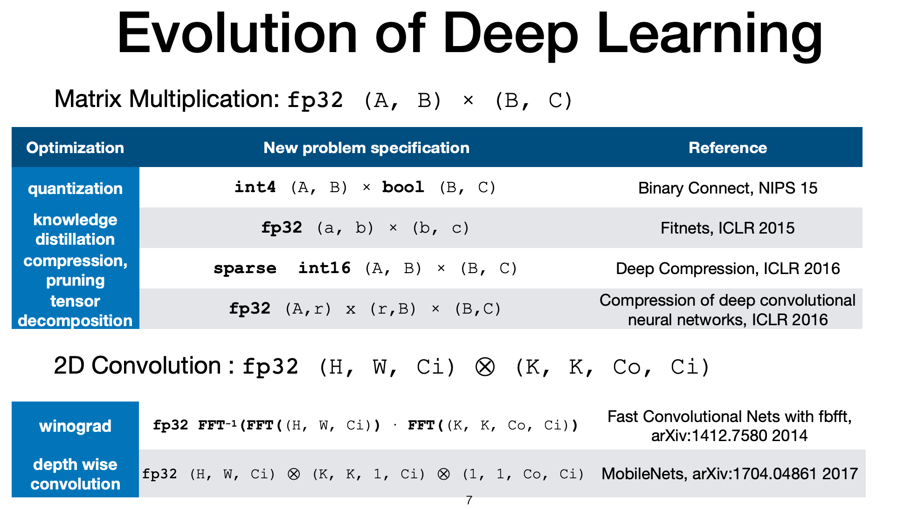

* Specialization Challenge
  * Tape-out costs for ASICs is exorbitant
    * 10x cost gap between 16nm and 65nm
    * 5nm ~ 800M$
  * Risky bet to design hardware accelerators for ever-changing applications
    * Flexibility vs. Efficiency Tradeoffs
    * Microprocessors(0.1) -> DSPs(1) -> Decicated HW(100)   (MOPS/mW)
* TPU: Google’s Entry in the Deep Learning Acceleration Race
  * Highlights (In-Datacenter Performance Analysis of a Tensor Processing Unit, ISCA 2017)
    * Custom ASIC deployed in datacenters since 2015
    * 65k 8-bit matrix multiply that offers peak throughput of 92 TOPS
    * Targets mainstream NN applications (MLPs, CNNs, and LSTMs)
    * Shows 30-80x improved TOPS/Watt over K80
  * Why Efficient
    * Integer inference (saves 6-30x energy over 16bit FP)
    * Large amount of MACs (25x over K80)
    * Large amount of on-chip memory (3.5x over K80)
  * TPU Roofline
    * 1350 Operations per byte of weight memory fetched
    * TPU的内存带宽太小了，34GB/s


* HW/SW Co-Design - #1 Tensorization
* HW/SW Co-Design - #2 Memory Architecting

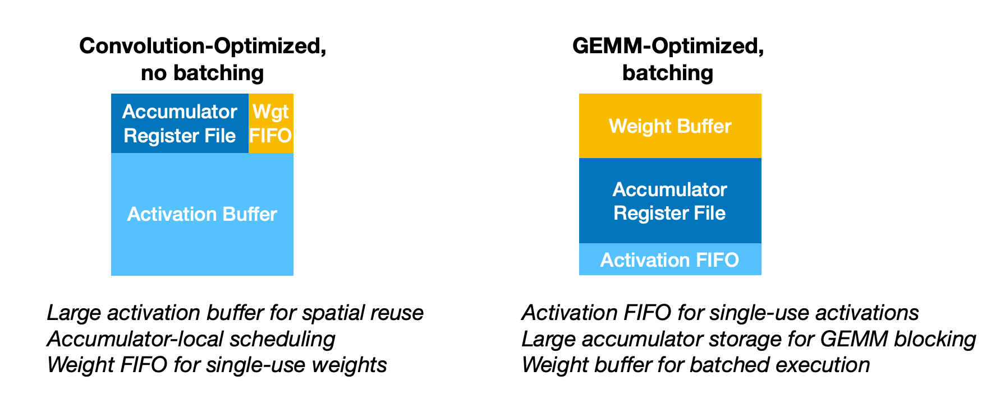

* HW/SW Co-Design - #3 Data Type

* VTA: Versatile Tensor Accelerator
  * a versatile and extendable deep learning accelerator for software codesign research and the development of next architectures
  * Features
    * Customizable tensor core, memory subsystem and data types based on bandwidth, storage and accuracy needs
    * Flexible CISC/RISC ISA for expressive and compact code
      * Goal: Provide the right tradeoff between expressiveness and code compactness 
      * Use CISC-ness to describe high-level operation (LD, ST, GEMM, ALU)
      * Use RISC-ness to describe low-level memory access patterns
      * Micro-op kernels are stored in a local micro op cache to implement different operators
    * Access-execute decoupling for memory latency hiding

* Latency Hiding: GEMM hide load latency
  * We want to enforce read-after-write (RAW) dependences
  * AND we want to enforce write-after-read (WAR) dependences
  * Takeaway: work partitioning and explicit dependence graph execution (EDGE) unlocks pipeline parallelism to hide the latency of memory accesses

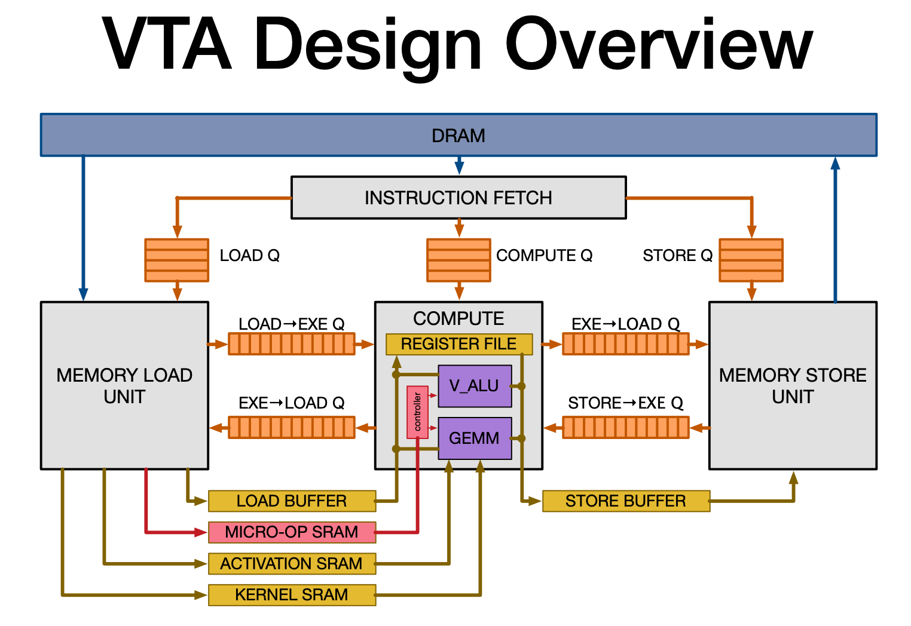


* VTA Design	
  * Instruction fetch stage fetches high-level instructions from DRAM, decodes them, and pushes commands to the relevant queue (LD, EX, ST)
  * The load stage executes load commands to populate activation & kernel memories, the micro-op cache, and a load buffer for loading in values for the register file
  * Compute stage executes compute commands to perform vector ALU operations or GEMM operations to update the register file according to micro-coded kernels
  * Memory store stage executes store commands to store flushed register file values back to DRAM from the store buffer
  * Stages communicate via dependence token queues to indicate that they may proceed to execute the command they’re about to work on
  * Memories that connect pipeline stages follow a strict single producer, single consumer rule (fan-in=1, fan-out=1). This enables data flow execution, and makes this design modular
* TVM DSL allows for separation of schedule and algorithm

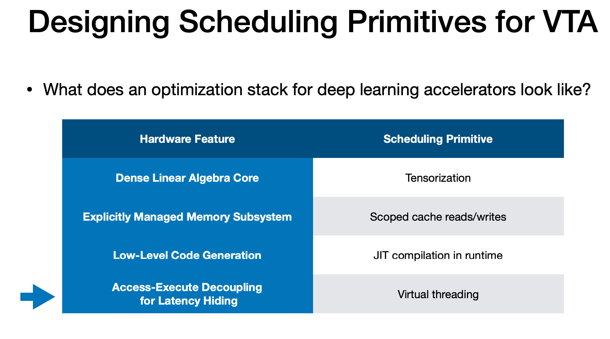

* Virtual Threading
  * How do we take advantage of pipeline parallelism with virtual threading?
  * Hardware-centric view: pipeline execution
  * Software-centric view: threaded execution
  * Final step: virtual thread lowering into a single instruction stream
    * Push and pop commands dictate how to interact with the hardware dependence queues

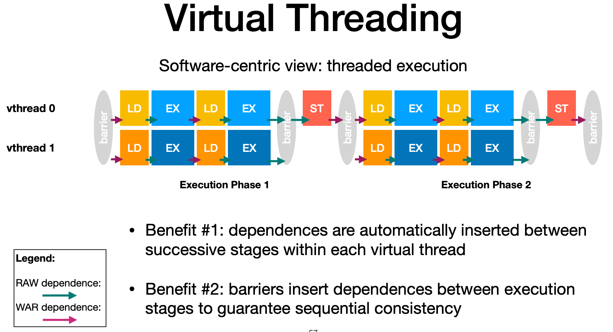

* Programming for VTA in TVM

  * How do we partition work and explicitly manage on-chip memories?

    * ```python
      // Tile
      yo, xo, yi, xi = s[OUT].tile(y, x, 4, 4)
      // Cache read
      INP_L = s.cache_read(INP, vta.act, [OUT])
      s[INP_L].compute_at(s[OUT], xo)
      ```

  * How do we take advantage of tensorization?

    * ```python
      // Tensorize
      s[OUT_L].tensorize(ni)
      ```

  * How do we take advantage of virtual threading?

    * ```python
      // Virtual Threading
      tx, co = s[OUT_L].split(co, factor=2)
      s[OUT_L].bind(tx, thread_axis(“cthread”))
      ```


##### Lecture 9: Memory Optimization

* DL stack 中的 Computational Graph Optimization and Execution 环节
* Question for this lecture:
  * Why do we need automatic differentiation that extends the graph instead of backprop in graph?
* Executor的构建，中间节点分配临时内存，Temporary space linear to number of ops
  * Dynamic Memory Allocation
  * Static Memory Planning
    * Analog: register allocation algorithm in compiler
    * Inplace store the result in the input
      * We can only do inplace if result op is the only consumer of the current value
    * Normal Sharing reuse memory that are no longer needed
* Memory Allocation and Scheduling
  * Memory Planning Algorithm: 维护内存tag，一种实现见【code-reading笔记】-- tvm -- 内存管理
  * Concurrency aware Heuristics:
    * Restrict memory reuse in the same colored path
    * color通过不断地找最长路径生成，比如第一条最长路径用一个颜色
  * Introduces implicit control flow dependencies between ops
    * Solutions:
      * Explicitly add the control flow dependencies
        * Needed in TensorFlow
      * Enable mutation in the scheduler, no extra job needed
        * Both operation “mutate” the same memory, supported in MXNet

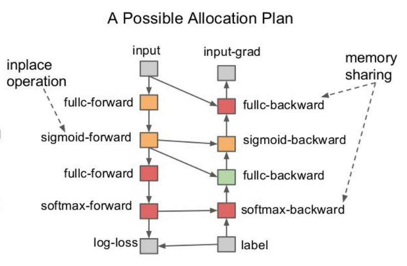

* We are still Starved
  * For training, cost is still linear to the number of layers
  * Need to book-keep results for the gradient calculation
* Trade Computation with Memory
  * Only store a few of the intermediate result
  * Recompute the value needed during gradient calculation
  * tf中需要显示添加 control dependency（指向希望执行的op前的节点）
  * **Sublinear Memory Complexity**
    * O(K) + O(N/K) ---> sqrt(N) memory cost plan


##### Lecture 10: Parallel Scheduling

* Questions to be answered
  * What are common patterns of parallelization
  * How can we easily achieve these patterns
  * What about dynamic style program 
* Model Parallel Training
  * Map parts of workload to different devices
  * Require special dependency patterns (wave style)
    * e.g. LSTM

* Data Parallelism
  * Train replicated version of model in each machine
  * Synchronize the gradient
    * control dependency: weight更新指向device forward（提前load data）
* Goal of Scheduler Interface
  * 串行的方式写程序，内部尽可能并行，有点像 C++ 编译器，只要没有更高层次的并行即可work
  * Schedule any resources
    * Data
    * Random number generator
    * Network communicator
* DAG Graph based scheduler
  * `engine.push(lambda op, deps=[])`
  * tf使用，Useful when all results are immutable
* Discussion: How to schedule the following ops
  * Random number generator
  * Memory recycling，类似的还有 Write After Read Mutation
  * Cross device copy
  * Send data over network channel
* Mutation aware scheduler: solve these problems much easier than DAG based scheduler
  * Tag each Resource
  * Push Operation: 记录read/mutate的资源
* Queue based Implementation of scheduler
  * Like scheduling problem in OS
  * Maintain a pending operation queue，再给每个资源维护一个queue
  * Schedule new operations with event update

##### Lecture 11: Distributed Training and Communication Protocols

* Recap: Parallel Scheduling Engine
* How to do Synchronization over Network
  * Distributed Gradient Aggregation, Local Update

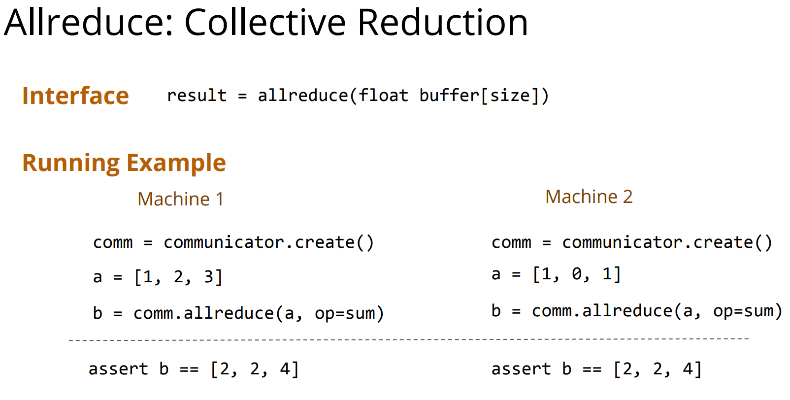

```python
grad = gradient(net, w)
for epoch, data in enumerate(dataset):
  g = net.run(grad, in=data)
  gsum = comm.allreduce(g, op=sum)
  w -= lr * gsum / num_workers 
```

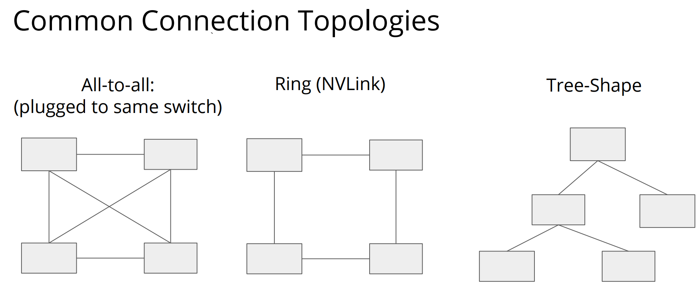

* How to implement AllReduce
  * Tree-Shape
    * Logically form a reduction tree between nodes
    * Aggregate to root then broadcast
  * Ring
    * Form a logical ring between nodes
    * Streaming aggregation
    * 算法：
      * 先 reduce_scatter：Each node have correctly reduced result of one segment!
      * 再 all_gather
* with TF: TFOptimizer 的 ApplyGradient 方法更新梯度，易于直接使用TF原生与layerwise的Optimizer

* AllReduce Libraries
  * MPI offers efficient CPU allreduce
  * dmlc/rabit: fault tolerant variant
  * facebookincubator/gloo
  * Parameter Hub: from UW
  * NCCL: Nvidia’ efficient multiGPU collective
* GPUDirect and RMDA
  * 前者不经过网卡
* NCCL: Nvidia’s Efficient Multi-GPU Collective
  * Uses unified GPU direct memory accessing
  * Each GPU launch a working kernel, cooperate with each other to do ring based reduction
  * A single C++ kernel implements intra GPU synchronization and Reduction
* Schedule Allreduce Asynchronously
  * `B = comm.allreduce(A)`
  * `engine.push( lambda: B.data=allreduce(A.data), read=[A.var], mutate=[B.var, comm.var])`
* PS Interface for Data Parallel Training
  * Synchronous: bulk synchronous parallel (BSP)
  * Asynchronous
    * gradient staleness
  * Integrate Schedule with Networking using Events
    * Use the callback to notify engine that data receive is finished

```python
grad = gradient(net, w)
for epoch, data in enumerate(dataset):
  g = net.run(grad, in=data)
  ps.push(weight_index, g)
  w = ps.pull(weight_index)
```

* The Cost of PS Model: All to All Pattern
  * Each worker talks to all servers
  * Shard the parameters over different servers
* Discussion: What’s Special about Communication Requirements for Model Parallel Training?
  * Track dependency correctly
  * Resolve resource contention and allocation
  * Some special requirement on channel
    * Allreduce: ordered call

```python
for i in range(num_layers):
  for t in range(num_time_stamp):
    out, state = layer[i].forward(data[i][t], state)
    data[i+1][t] = out.copyto(device[i])
```


##### Lecture 12: Model Serving

* Model Compression
  * Tensor decomposition
    * Matrix decompostion
    * "Compression of deep convolutional neural networks for fast and low power mobile applications." ICLR (2016)
      * finetune减小效果损失
  * Network pruning
    * "Deep Compression: Compressing Deep Neural Networks with Pruning, Trained Quantization and Huffman Coding." ICLR (2016)
    * 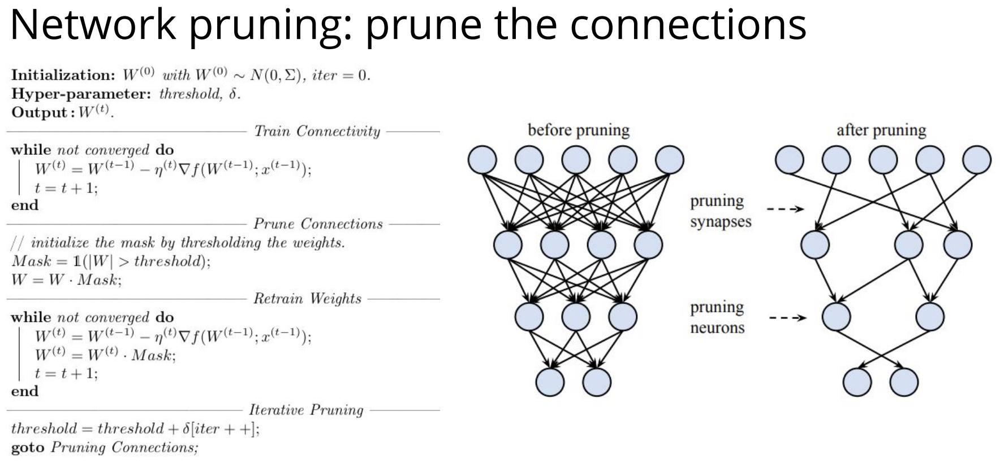
    * 
  * Quantization
    * pruning + quantization 效果最好（相比两者的单独使用以及SVD），大道至简？
    * XNOR-Net: binary weights/binary input and weights
    * quantize during training
  * Smaller model
    * Knowledge distillation: "Fitnets: Hints for thin deep nets." ICLR (2015)
  * Others
    * Specialized hardware for sparse models
      * Song Han, et al. “EIE: Efficient Inference Engine on Compressed Deep Neural Network.” ISCA 2016
    * Accuracy and resource trade-off
      * Han, Seungyeop, et al. "MCDNN: An Approximation-Based Execution Framework for Deep Stream Processing Under Resource Constraints." MobiSys (2016).

* Serving system

  *  Goals:

    * High flexibility for writing applications
    * High efficiency on GPUs
    * Satisfy latency SLA

  * Challenges

    * Provide common abstraction for different frameworks
    * Achieve high efficiency
      * Sub-second latency SLA that limits the batch size
      * Model optimization and multi-tenancy causes long tail

  * "Nexus: efficient neural network serving system"

    * Frontend runtime library allows arbitrary app logic

    * Packing models to achieve higher utilization

    * A GPU scheduler allows new batching primitives

    * A batch-aware global scheduler allocates GPU cycles for each model

      * For high request rate, high latency SLA workload, saturate GPU efficiency by using large batch size

    * ```python
      class ModelHandler:
        # return output future
        def Execute(input)
      class AppBase:
        # return ModelHandler，传入SLA应该是为了方便调度
        def GetModelHandler(framework, model, version, latency_sla)
        # Load models during setup time, implemented by developer
        def Setup()
        # Process requests, implemented by developer
        def Process(request)
      ```

  * 按model类型分类：

    * 高SLA高QPS：large batch size
    * 低SLA高QPS：optimized split batching
      * 每个op可以有不一样的batch size...... 优化最大吞吐。这样不会增加内存带宽消耗么？   GDR可以减少到一次
    * 高SLA低QPS：execute multiple models on one GPU
      * Execute multiple models in round-robin fashion，可最小化等batch的latency
    * 低SLA低QPS：Solution depends
      * If saturate GPU in temporal domain due to low latency: allocate dedicated GPU(s)
      * If not: can use multi-batching to share GPU cycles with other models

    * 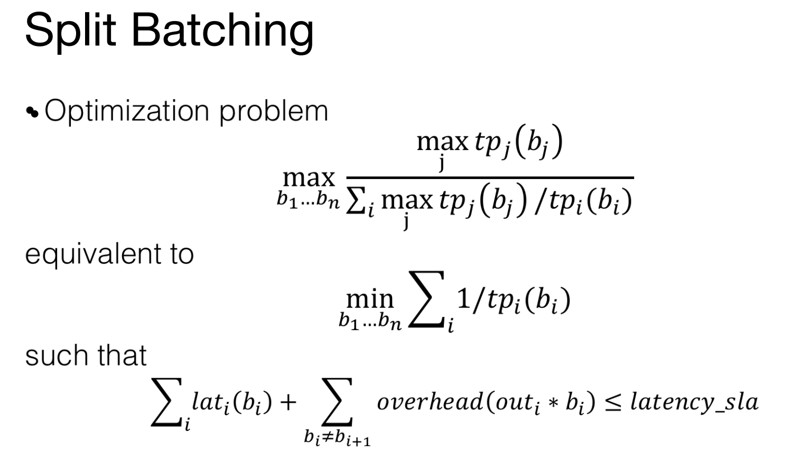

    * Prefix batching for model specialization：类似于sparse/dense op分离的思路

  * Meet Latency SLA: Global scheduler

    * Best-fit decreasing algorithms


### MLSys in the Cloud

https://outerbounds.com/blog/modern-data-stack-mlops/ MUSTDO

cs294的三篇推荐论文：MUSTDO

https://arxiv.org/abs/2205.07147

https://arxiv.org/abs/2006.07512

https://www.usenix.org/system/files/osdi21-qiao.pdf


### ToB

[Palantir](https://www.palantir.com/)

[C3.ai](https://c3.ai/#null)

[一篇分析 ToB 与 ToC 技术上区别的文章](https://zhuanlan.zhihu.com/p/341358485)


### 论文阅读

已读，待整理：

#### MLSys: The New Frontier of Machine Learning Systems

#### Deep Neural Networks for Youtube Recommendations, RecSys 16

#### Wide & Deep learning for Recommender Systems, RecSys 17

1.Introduction

* Wide ~ Memorization: 模型直接学习并利用历史数据中物品或者特征的“共现频率”的能力
* Deep ~ Generalization: 模型传递特征的相关性，以及发掘稀疏甚至从未出现过的稀有特征与最终标签相关性的能力
* Generalized linear models with nonlinear feature transformations
* cross-product transformations: 特征工程的概念，交叉积变换，缺点是无法 generalize 没出现过的 query-item feature pairs

问题：输入是稀疏高秩矩阵，缺少 interactions，难以利用它学到合适的低维 embedding

3.WIDE & DEEP Learning

3.1 The Wide Component

利用 cross-product transformation 提供多个特征的非线性

<->  对比：[Deep Neural Networks for YouTube Recommendations ] 用平方 和 平方根项 提供单个特征的非线性

3.3 Joint Training of Wide & Deep Model

注意辨析 joint training 和 ensemble 的区别
* 前者是共同训练，后者不是
* 后者模型可以更大
* 前者，Wide 只需要给 Deep 补少量 cross-product feature transformations

4.System Implementation

4.2 Model Training

* warm-starting system
* dry run
* sanity check

Appendix

* 概念：AUC：ROC曲线下方的面积，ROC横坐标FPR，纵坐标TPR
* 资源：
  * 这个大佬的专栏很实用，讲解tensorflow和推荐系统，https://zhuanlan.zhihu.com/learningdeep
* 思考：可否联系到IRLS方法，最优化稀疏矩阵的秩，用一个类似的矩阵学习秩的表示


**改进：Deep&Cross模型 (DCN)**

* 多层交叉层: $x_{l+1}=x_0x_l^Tw_l+b_l+x_l$ 
  * 参数引入较为克制，增强模型的非线性学习能力
  * 解决了Wide&Deep模型人工组合特征的问题

#### A Hitchhiker's Guide On Distributed Training Of Deep Neural Networks, JPDC 18

#### TFX: A TensorFlow-based production-scale machine learning platform

#### TensorFlow: A system for large-scale machine learning, OSDI 16

#### Clipper: A Low-Latency Online Prediction Serving System, NSDI 17

low latencies, high throughputs, and improved accuracy

prediction cache, batching queue

##### Model abstraction layer

用object store存模型，减少初始化开销

prediction cache：本质上类似SHARED属性（同一batch内的某一特征用相同的预估结果）。两者的区别在于，前者的输入更简单，以模型和req id为标识，易于做cache操作；后者是feature层面，更精细。推荐系统入图的特征输入很难做到完全一致，因此做prediction cache操作难度较大。

batching：动态选batch size的方式
* additive-increase-multiplicative-decrease (AIMD) scheme 
* quantile regression
* delayed batching：按攒batch的timeout来delay，适合并行优化明显的模型

model container: 无状态服务
* Clipper performs adaptive batching independently for each replica

##### Model selection layer

动态调整选用模型的策略，推荐系统采用这类技术比CV/NLP难度更大

* Single Model Selection Policy
  * address the trade-off between exploring possible actions and exploiting the estimated best action. 
* Ensemble Model Selection Policies
  * Robust Prediction 
    * agreement衡量prediction confidence 
    * 有针对degraded模型的降级机制
  * Straggler Mitigation
* Contextualization: instantiate a unique model selection state for each user, context, or session.


#### Hidden Technical Debt in Machine Learning Systems, NIPS 15

boundary erosion, entanglement, hidden feedback loops, undeclared consumers, data dependencies, configuration issues, changes in the external world, and a variety of system-level anti-patterns.

2. Complex Models Erode Boundaries
* Entanglement: 即使多模型/超参的配置独立，效果也会互相影响
* Correction Cascade: 模型级联是 hidden debt
* Undeclared Consumers: 需要SLA (service-level agreement)

3. Data Dependencies Cost More than Code Dependencies
* Underutilized dependencies: legacy/bundled/epsilon/correlated, use exhaustive leave-one-feature-out evaluations to detect

4. Feedback Loops
* direct: related to bandit algorithms, costly
* hidden: two independent systems may interact

5. ML-System Anti-Patterns
* Glue Code: hard to achieve a domain-specific goal
* Pipeline Jungle: 特征工程的意义所在，thinking holistically about data collection and feature extraction
* Dead Experimental Codepaths
* Abstraction Debt
* Common Smells

6. Configuration Debts
* Feature A was incorrectly logged from 9/14 to 9/17
* Feature B is not available on data before 10/7
* The code used to compute feature C has to change for data before and after 11/1 because of changes to the logging format
* Feature D is not available in production, so a substitute features D′ and D′′ must be used when querying the model in a live setting
* If feature Z is used, then jobs for training must be given extra memory due to lookup tables or they will train inefficient
* Feature Q precludes the use of feature R because of latency constraints.

7. Dealing with Changes in the External World


#### Ad Click Prediction: a View from the Trenches, KDD 13
2. Brief System Overview：Google 场景是搜索广告

3. Online Learning and Sparsity

* FTRL-Proximal(Follow The Proximally Regularized Leader): get both the sparsity provided by RDA and the improved accuracy of OGD

* [在线学习（Online Learning）导读 - 吴海波的文章](https://zhuanlan.zhihu.com/p/36410780)
* FTRL的数学本质：SGD（梯度 + L2）+稀疏性（L1）

* 李亦锬大佬的机器学习答题集，很精彩，其中介绍了 FTRL 的实践意义
  https://zhuanlan.zhihu.com/p/20693546

4. Saving Memory at Massive Scale

进一步节省PS内存的方式

* Probabilistic Feature Inclusion
  * 出于效果、回溯性的考量，只考虑在 serving 时省内存
  * Poisson Inclusion, Bloom Filter Inclusion
* Encoding Values with Fewer Bits
  * $\omega_{i,rounded}=2^{-13}\lfloor{2^{13}\omega_i+R}\rfloor$
* Training Many Similar Models
  * savings from not representing the key and the counts per model
* A Single Value Structure
  * 动机是省内存，本质上有点像是对极其相似的 models 的公共参数做 cotrain
  * 用于特征淘汰、特征选择等实验场景 (Fast prediction of new feature utility. ICML, 2012)
* Computing Learning Rates with Counts

* Subsampling Training Data: 然后给负样本的 loss 增加权重，保证“期望上”目标函数的一致性

5. Evaluating Model Performance

* Progressive Validation: online loss, relative changes

6. Confidence Estimates

* 定义并估出了不确定度的 upper bound: 学习率向量点乘输入向量

7. Calibrating Predictions

* 有 Poisson regression、isotonic regression 等手段
* 系统的 inherent feedback loop 不保证理论准确性

8. Automated Feature Management

* 特征平台化

9. Unsuccessful Experiments

* Feature Hashing, Dropout, Feature Bagging, Feature Vector Normalization


机器学习框架易用性

* a high-dimensional visualization tool was used to allow researchers to quickly see effects across many dimensions and slicings
* enables data sources and features to be annotated. Automated checks can then be run to ensure that all dependencies have the appropriate annotations, and dependency trees can be fully resolved.


#### XDL: An industrial deep learning framework for high-dimensional sparse data, KDD 19

MPI (All Reduce) 和 PS，两种分布式计算的发展方向

Sparse + Dense

* SparseNet: Representa-tion learning which captures information from high-dimensional sparse input and embeds them into a low-dimensional space

* DenseNet: Function fitting which models the relationship between dense em- bedding representation and supervised label

In order to facilitate deployment on various computing platforms,
XDL can be scheduled by multiple resource management platform, like Yarn, and provides data I/O interfaces to various data storage systems, like HDFS and Kafka.

* I/O
  * Hierarchical sample compression: prefix tree


* Workflow pipeline

  * I/O: read sample and group mini-batch -> prefetch (maybe cudaMemcpyAsync()) -> pull/forward/backward/push
  * SparseNet and DenseNet

* Optimization for Advanced Model Server

  * Network: [Seastar](https://github.com/scylladb/seastar) + zero-copy/CPU-binding

* Online Learning with XDL

  * Feature Entry Filter
  * Incremental Model Export
  * Feature Expire

#### Ethane: Taking control of the enterprise, SIGCOMM 2007

make networks more manageable and more secure，一种思路是全方位的增加控制，相当于新增一层，只是 hide 了复杂度；于是提出 ethane 解决这一问题

ethane的思想：
* The network should be governed by policies declared over high-
level names
* Policy should determine the path that packets follow
* The network should enforce a strong binding between a packet
and its origin.

Ethane的优势：
* Security follows management.

* Incremental deployability.

* Significant deployment experience.
  
  
#### Scaling distributed machine learning with the parameter server, OSDI 2014

PS架构的优势主要还是高可用(system efficiency)

2.2
* distributed subgradient descent

3.6 User-defined Filters
* signifi-cantly modified filter
* KKT(见5.1)：特征重要性筛选

4.Implementation

4.2 Messages
* key-caching and value-compression can be used jointly.
* key-cache让sender只需要传key lists的hash
* 用snappy压缩 zero value

4.3 Consistent Hashing
一致性hash和 key-range 的概念紧密相连，论文 Chord: A scalable peer-to-peer lookup protocol for Internet applications

4.5 Server Management
* 计算节点分为server node和worker node
* server共同维持全局共享的模型参数
* workers保留一部分的训练数据，并且执行计算
* worker只和server有通信，互相之间没有通信

examples
* CountMin Sketch Algo 有点像 bloom filter

PS运维：
* expectation - current_situation = operations
* 服务发现、数据发现

性能优化：
* 双buffer + RCU，读不被锁阻碍
* 简化版读写锁，优化系统态开销

#### Serving DNNs like Clockwork: Performance Predictability from the BottomUp, OSDI 2020

[presentation](https://www.usenix.org/conference/osdi20/presentation/gujarati) 挺有意思

model serving: ML system's "narrow waist"

这篇文章尝试解决服务化请求长尾问题

首先分析产生长尾的原因：out-of-order scheduling, interference from concurrency, power saving modes, and network queuing delays.
然后基于以下两个假设：
1) “DNN inference is predictable.”
2) 能限制系统到应用层面的决策能力（减少worker内部的并行）

提出解决方案：
分布式系统常用的思路，request打到worker之前，先过一个中心controller，中心controller掌握全局信息（模型是否load、worker是否pending等），预测latency是否会超过SLA，以决定将请求打到哪个worker

感觉这一系统难以直接应用于大公司的场景，因为：

1.需要和rpc框架做更深的结合

* 长尾问题本身有一部分是来自于服务化带来的网络传输开销，比如thrift worker负担，只有rpc框架能掌握更多信息
* 如果要落地到生产场景，自制的简陋 controller 不易推广

2.自身的优势不明显

* 分业务服务化部署、并且是online learning的场景，显存不是瓶颈，模型本身已经是preload了
* scalable能力未经过验证 (6.6)，controller成为瓶颈

有启发的地方
* 框架内的page cache可以借鉴一下 (https://gitlab.mpi-sws.org/cld/ml/clockwork/-/blob/master/src/clockwork/cache.h)

#### The Hardware Lottery, 2020

https://hardwarelottery.github.io/

* hardware, software and ML research communities evolve in isolation
  * Our own intelligence is both algorithm and machine.
  * Moore's Law ---> The predictable increases in compute and memory every two years meant hardware design became risk-averse.
  * machine learning researchers rationally began to treat hardware as a sunk cost to work around rather than something fluid that could be shaped
* The Hardware Lottery
  * "Happy families are all alike, every unhappy family is unhappy in it’s own way." (Tolstoy & Bartlett, 2016)
  * e.g. Babbage 的构想直到二战 electronic vacuum tubes 的使用才成为现实。"being too early is the same as being wrong."
  * von Neumann Bottleneck — the available compute is restricted by “the lone channel between the CPU and memory along which data has to travel sequentially” (Time, 1985).
  * GPU 并行能力 ---> 高 FLOPS ---> 能做矩阵乘 ---> 训得动深度神经网络
* The Persistence of the Hardware Lottery
  * sparsity ~ Ampere Architecture
  * 较为安全的硬件优化方向：matrix multiplication, unstructured sparsity, weight specific quantization
  * the difficulty of trying to train a new type of image classification architecture called capsule networks on domain specialized hardware
* The Likelyhood of Future Hardware Lotteries
  * how much future algorithms will differ from models like deep neural networks?
    * 许多子领域，参数量对效果提升的边际效应在下降（近似对数关系）
    * 100TB model (fp16) ~ 50T ~ 50万亿参数
    * Our own intelligence relies on decentralized local updates which surface a global signal in ways that are still not well understood
* The Way Forward
  * Producing a next generation chip typically costs $30-80 million dollars and takes 2-3 years to develop
  * A software evolution
    * one way is to focus on the development of domain-specific languages which cater to a narrow domain.
    * another way is to automatically auto-tune the algorithmic parameters of a program based upon the downstream choice of hardware.
* 另一篇强调 General Method + 算力 大力出奇迹的 blog: http://www.incompleteideas.net/IncIdeas/BitterLesson.html


#### Deep Learning Inference in Facebook Data Centers: Characterization, Performance Optimizations and Hardware Implications

1. Introduction

* general requirements for new DL hardware designs:
  * High memory bandwidth and capacity for embeddings 
  * Support for powerful matrix and vector engines 
  * Large on-chip memory for inference with small batches 
  * Support for half-precision floating-point computation

2. Characterization of DL Inference

* Ranking and Recommendation
  * embedding lookup 硬件层面分析
    * 特点是 low spatial locality，caching 难度高
    * High-bandwidth memory (HBM): 性能高，容量不够
    * Non-volatile memory (NVM): bandwidth低 不可行、成本低
* CV: 图像识别、目标检测、视频理解
  * number of operations per weight 高
  * number of operations per activation 不高
* NLP: NMT(Neural machine translation) uses seq2seq
  * parallelism: 针对 RNN-based approaches 的并行化方案，比如 stacked conv, transformer

* computation kernels 分析
  * 数据中心成本：fc > embedding lookup > tensor manipulation > conv
  * fc layer 分析：图内第一层运算抽象成矩阵乘（当batch size M 较小时，BLAS3 趋近于 BLAS2，matrix multiplication engine 效果削弱）
    * When an M×K matrix activation matrix is multiplied with a K×N weight matrix, we compute 2MKN operations while reading KN weights, leading to 2M operations per weight.
    * Similarly, the number of operations per activation is 2N.

3. Performance Optimizations

* bf16 sum pooling 是优化方向
* intel int8 multiplication with 16-bit accumulation 提升一倍吞吐

* FBGEMM, an algebra engine
  * outlier-aware quantization: $W = W_{main}+W_{outlier}$
    * outlier uses 32-bit accumulation. We find that Woutlier becomes a sparse matrix, often with density less than 0.1%, especially when combined with sym-metric quantization [39].

* accuracy challenges
  * Fine-grain Quantization
  * Quantization-aware Training
  * Selective Quantization
  * Outlier-aware Quantization: 更精细、更窄地选取 quantize range
  * Net-aware Quantization: if an operator is only followed by ReLU, we can narrow down the range by excluding negative values

* HPC challenges
  * HPC 习惯 “pack” a block of input matrices into a format friendly for vectorization and cache locality, 但对于DL领域 tall-skinny matrices，pack 会带来 overhead
  * DL不完全是矩阵乘：比如conv op，转化为矩阵乘需要提前做 `im2col` 操作，有 overhead，因此需要专门做 kernel fusion 提供 conv interface
    * This will also enable algorithmic optimizations such as Winograd or FFT-based convolution as in cuDNN with automatic choice of the best algorithm for given tensor shapes.
    * reduced-precision 计算也需要专门的 fusion，一些库未能满足

```c++
template<typename T_PACK_A, typename T_PACK_B, typename T_C, typename OUT_FUNCTOR>
void gemmPacked(
  // packed inputs
  T_PACK_A& packA, T_PACK_B& packedB,
  // output
  T_C* C, uint32_t ldc,
  // post-processing functor, e.g. Relu
  OUT_FUNCTOR& outProcess);
```

* The packing of matrix A can be specialized and fused with memory bandwidth bound operations such as `im2col`, row-wise sum for asymmetric quantization, or depth-wise convolution.

* whole graph optimization
  * 手动 fusion 仍有必要

4. Application Driven HW Co-design Directions

* Recommendation models not only require a huge memory capacity but also high bandwidth.
* 优化的副作用：比如 avx512 降频，见 Computer-Architecture.md
* 增加 tiers 的 trade-offs：传输、压缩解压开销，a hypothetical accelerator with 100 TOP/s compute throughput would require a few GB/s PCIe and/or network bandwidth

5. Related Work

* matrix-vector engine、FPGA、TPU

* ML benchmark


#### Practical Lessons from Predicting Clicks on Ads at Facebook, KDD 2014

2.指标

* Normalized Entropy: the average log loss per impression divided by what the average log loss per impression would be if a model predicted the background click through rate (CTR) for every impression. 
  * 用 background CTR 给 loss 做 normalize
* RIG (Relative Information Gain) = 1 - NE
* Calibration: the ratio of the average estimated CTR and empirical CTR
* AUC(Area-Under-ROC): 衡量排序， 忽略低估与高估

3.Prediction Model Structure

* BOPR (Bayesian online learning scheme for probit regression): 假定高斯分布，在线学习分布的参数
  * Both SGD-based LR and BOPR described above are stream learners as they adapt to training data one by one.
  * BOPR 相比 SGD-based LR 的区别在于，梯度下降的 step-size 由 belief uncertainty $\sigma$ 控制，也是在线更新的参数3
* 3.1 Decision tree feature transforms
  * bin the feature
  * build tuple input features
    *  joint binning, using for example a k-d tree
    * boosted decision trees
  * follow the Gradient Boosting Machine (GBM) [5], where the classic L2-TreeBoost algorithm is used
  * We can understand boosted decision tree based transformation as a supervised feature encoding that converts a real-valued vector into a compact binary-valued vector.

* 3.2 Data freshness
  * The boosted decision trees can be trained daily or every couple of days, but the linear classifier can be trained in near real-time by using some flavor of online learning.

* Experiment result for different learning rate schmeas for LR with SGD
  * NE: per weight > global > constant > per weight sqrt > per coordinate

* BOPR 与 LR 对比
  * LR's model size is half
  * BOPR provides a full predictive distribution over the probability of click. This can be used to compute percentiles of the predictive distribution, which can be used for explore/exploit learning schemes

4.Online Data Joiner

* length of waiting time window: 定义"no click"，需要 tune
  * 过长会增加buffer、影响"recency"
  * 过短会影响"click coverage" => the empirical CTR that is somewhat lower than the ground truth

* 数据结构：HashQueue
  * consisting of a First-In-First-Out queue as a buffer window and a hash map for fast random access to label impressions.
  * operations: enqueue, dequeue, lookup

* Anomaly detection mechanisms
  * 监测到数据剧烈变化，断流训练器

5.Containing Memory and Latency

* number of boosting trees: 500个比较折中
* boosting feature importance
  * the cumulative loss reduction attributable to a feature
  * 对多个 trees 的 reduction 相加
* features
  * contextual features: local time of day, day of week, device, current page
  * historical features: ctr of the ad in lask week, avg ctr of the user
  * historical features 明显比 contextual features 重要
  * contextual features 更需要 data freshness

6.Coping with Massive Training Data

* Uniform subsampling: sample rate 10% 

* Negative down sampling: sample rate 2.5%

* Model Re-Calibration: $q=\frac{p}{p+\frac{1-p}{w}}$

#### DCAF: A Dynamic Computation Allocation Framework for Online Serving System, DLP-KDD 2020

* 加强 召回、粗排、精排 的联动，向统一分配算力的方向发展
* We formulate this resource allocation problem as a knapsack problem and propose a Dynamic Computation Allocation Framework (DCAF).

* 基于背包问题的机制，有限资源最大收益
  * 理论：https://en.wikipedia.org/wiki/Duality_(optimization)，凸优化，证明了在现实算力约束的条件下（有两个直觉的前提），用二分来找 global optimal lambda 即可获取最优解
    * construct the Lagrangian

* 系统有 control 能力，能动态响应流量波动
  * 理论：https://en.wikipedia.org/wiki/PID_controller

* Online Decision Maker
* Information Collection and Monitoring
* lambda 离线计算，Qij 在线预估
* Request Value Estimation.
* Policy Execution: assign j and PID control，我理解 PID controller 是为了给 lambda 更新慢的的情况来兜底
* Offline Estimator
* 感觉是个离线 batch 任务，模型预估不同算力下的ctr

* Experiments：控精排条数，增加条数有明显的边际效益
* TODO: fairness 问题、全链路算力分配

* 一些引用的论文
  * Deep Learning Inference in Facebook Data Centers: Characterization, Performance Optimizations and Hardware Implications
  * RobinHood: Tail latency aware caching–dynamic reallocation from cache-rich to cache-poor


#### A scalable pipeline for designing reconfigurable organisms, PNAS 2020

ML with bioengineering

如何探索更高效的器官组织

* 模拟(silico)：performant + conform to constraints
* 模拟(silico) ->现实(vivo)：noise resistance + build filter
* 目标：见 Object Manipulation 小节
